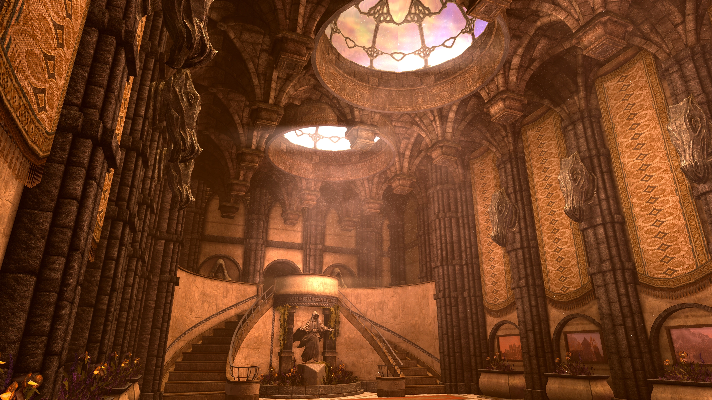
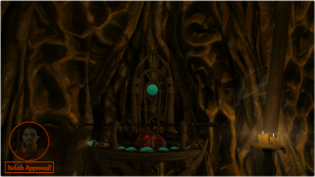

# CACO'S LICENTIA 11 WRITEUP

**Please Note:** _Licentia 11_ is not presently available on _Wabbajack._ It is in development and will likely be so for some time. This document is intended to provide you with a general idea of where I'm going with the list. The thing is though, to keep from resting on my laurels, I'm planning a series of staged rollouts beginning at the end of September. Try the test profile on September 24th, and opt into the **ELEVEN** role on the _Jolly-Co-Operators_ server to get pings about weekly updates!

## FEATURED MODS

### Artifacts of Skyrim Revised

 

by HeirOfTheSeptims - [Patreon Link](https://www.patreon.com/tyro/)

"Adds hundreds of new artifacts, each with their own unique effects, appearance, and story. Some artifacts are easy to find, others are quite well hidden. Some are powerful, some are utterly useless!" 

## Better Staff Enchanting

by HeirofTheSeptims - [Patreon Link](https://www.patreon.com/tyro/)

"You may now put any craftable staff enchantment on any unenchanted staff you possess (Including those added by mods, with one exception.  See compatibility (on the Patreon Page.)"

### The ~~Three~~ Two Museums

My goal as of now is to include as many collectibles for the LOTD museum as I can, backed up with stable gameplay to encourage long, obsessive playthroughs. One thing I do know is that every quest mod supported by LOTD will be included. There will also likely be a variant of a patch that makes LOTD quest rewards require more displays to unlock. Unfortunately I have chosen to remove _Relics of Hyrule_ as I receive occasional objections to it and do not engage much with the content. I love _Artifacts of Skyrim Revised_ almost as much as I do _CGO_ so that will likely never come out.

### Visual Mods

#### Texture Overhauls

- Skyland All-In-One
- Mrf's Markarth
- Illustrious Whiterun SE
- Riften of Reverie

Larger texture overhauls have been de-emphasized with _Licentia 11_ to allow for a broader spectrum of users. That said, most of the overhauls previously used are still in the list, so appearances at moderate resolutions will not be greatly compromised while vastly improving performance and reducing overall installation size. Essentially, a setup extremely similar to @Sparr's "performance profile" is now the primary focus of the list.

#### Others

A lot of picky details have been removed in favor of base textures. Apparently I had a redundant mountains mod so that's gone, I'm still using _Dave's UFHD_ (Darker), _Embers XD, _Water for ENB_ and _Happy Little Trees_ for my four major elements.

### Animation Mods

- FNIS - Fores New Idles in Skyrim **(REPLACED BY THE FOLLOWING)**
- Project New Reign - Nemesis Unlimited Behavior Engine

This is a straight up successor to _FNIS._ Anytime you read anything about _FNIS_, just substitute _Nemesis_ for it because that's what this mod does in its place. 

- Simple Dual Sheath

Twin blood drenched greatswords crossed across a hot comic book babe's backside. Nuff said.

### Major Core Mods

- SSE Engine Fixes
- SSE Display Tweaks
- SSE Gameplay Tweaks
- powerofthree's Tweaks
- Scrambled Bugs
- Scrambled Eggchantments

Basically makes the whole game be less crappy. Memory management is better, large modlists work better, crashes happen less often, fewer freezes and infinite load screens. Display tweaks handles the visual output and Gameplay Tweaks renovates much of Skyrim's gameplay. 

**Please note, the above mods have config files with various extensions such as TXT, INI, and/or TOML.**

### HUD

- In Flux (To Be Continued)

I am trending toward _Nordic UI_ instead of _Dear Diary Dark Mode._ _Quick Loot_ is being removed because the EE version causes intermittent crashes and the RE version is long out of date. I will also likely remove _The Curator's Companion_ upon the recommendations of the LOTD team. It is pretty simple to add back if you visit the #additions channel and that way I don't have to take responsibility for any museum lockups that occur.

### Movement Overhauls

- True Directional Movement
- Better Jumping
- Sink or Swim
- Slip Off Slopes

These mods change the way movement and targeting works and add immersion features such as collapsing when dropping from a damaging height and sinking underwater in heavy armor to walk on the bottom. Try downing a waterbreathing potion and fighting at the bottom of the sea!

### Stealh Upgrades

- Detection Meter

### Audio

- Sons of Skyrim - Epic Metal Remix SSE
- Music Mods Merged
- Audio Overhaul Skyrim
- Immersive Sounds Compendium
- Realistic Dog Sounds
- Better Ambient Wolf Sounds

I used to have metal music all over the place suiting the logo but dropped it in, leaving only streamer MxR's theme song. Almost every major music mod on Nexus is now available for the rest. The audio overhauls are outdated as of the next version but should be brought in line soon. What about the dogs and wolves? Yeah, I just hate how they sound normally.

### Home Collection

As much as I enjoy my tiny role-playing homes I have decided to remove them due to lack of engagement. Likely only the CC houses and the two LOTD properties (including _Dovah Den_) will remain.

### Weather and Lighting

- Cathedral Weathers with Obsidian options and Diverse Seasons
- Lux
- Ljoss

I have decided to return to Cathedral Weathers and try to dial the rain back a notch or two. Lux is so overwhelmingly good I basically _have_ to start using it, hopefully the lower performance hit of the list will prevent shader crashes. My ENB will be Ljoss due to preference, as well as solidarity with a friend from the Lexy team.

