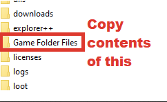

# DO NOT CLOSE ME

## This README is **NOT** optional! It is **NOT** an advice column! Licentia will **NOT** work AT ALL unless you follow it!

# READ IT!

- [DO NOT CLOSE ME](#do-not-close-me)
  - [This README is **NOT** optional! It is **NOT** an advice column! Licentia will **NOT** work AT ALL unless you follow it!](#this-readme-is-not-optional-it-is-not-an-advice-column-licentia-will-not-work-at-all-unless-you-follow-it)
- [READ IT!](#read-it)
- [Preamble](#preamble)
- [A STRONG WARNING](#a-strong-warning)
  - [Requirements](#requirements)
    - [System Specs](#system-specs)
  - [Installation](#installation)
  - [Pre-Installation](#pre-installation)
    - [Installing Microsoft Visual C++ Redistributable Package](#installing-microsoft-visual-c-redistributable-package)
    - [Steam Config](#steam-config)
  - [Using Wabbajack](#using-wabbajack)
  - [Downloading and Installing](#downloading-and-installing)
  - [Problems with Wabbajack](#problems-with-wabbajack)
  - [Post-Installation](#post-installation)
  - [Preparing the Game](#preparing-the-game)
  - [Crafting the Female Bodies](#crafting-the-female-bodies)
- [REDACTED. BODYSLIDES ARE INCLUDED AND NO LONGER NECESSARY. GO PLAY THE GAME!](#redacted-bodyslides-are-included-and-no-longer-necessary-go-play-the-game)
  - [Launching the Game](#launching-the-game)
- [PLEASE CLICK THE BELOW LINK TO CONTINUE THIS ESSENTIAL README. THEN RETURN HERE TO COMPLETE THIS ESSENTIAL README.](#please-click-the-below-link-to-continue-this-essential-readme-then-return-here-to-complete-this-essential-readme)
  - [Updating the Modlist](#updating-the-modlist)
  - [Removing the Modlist](#removing-the-modlist)
  - [Contact](#contact)
  - [Contributing](#contributing)
  - [Changelog](#changelog)

**All Hail ForgottenGlory for the above image!**

_If you are into an utterly degenerate vision of Skyrim focused on sheer sexual pain and suffering, or you want to experience the ultimate that Lover's Lab has to offer via its "SexLab" framework, this is not the modlist for you. Instead, I recommend "Dungeons & Deviousness" for the ultimate hardcore experience, or "Atelier" for the ultimate screenshot experience! And hell, why not give "Living Skyrim 3" a run as well?! You can find them here:_

https://www.fgsmodlists.com/home

_If you're looking for a modlist in between the two, with just a bit more racy content without all the slavery and suffering, featuring more of an "Eastern" flair -- tough melee parry-and-riposte gameplay and hand-picked custom combat animations and sexy oufits, try "Tsukiro" also available on the Wabbajack main menu!_

https://www.wabbajack.org/#/modlists/info?machineURL=tsukiro

_C'mon man. I'm begging you. Please do not play this modlist. It sucks. Go away! And don't step on my lawn!_

# Preamble

**This Modlist contains mods with sexual content and you need to be of legal age in your country (most western countries: 18+, some eastern ones: 21+)**.

I'm [cacophony](https://github.com/cacophony-wj), a humble person. Perhaps the _most_ humble person _ever_. (That goes along with the territory as the universe's giantest nerd.) Welcome to the latest incarnation of _Licentia_. This modlist has been completely revamped -- again -- to trim the fat and refocus the mod around fast action and pro-active questing as opposed to the ceaseless collection and micromanagement of previous versions. It is still intended primarily as a high fantasy "Game of Thrones" Skyrim -- ultimate power fantasy via the _Enairim_ collection of mods jumped up on steroids with _Vokriinator Black_ and _DServant's Archery_ and _Combat Gameplay Overhauls._ It also still includes the ability to create your own family throughout Skyrim via the use of _Fertility Mode_ patched for _OStim_ and the _ORomance_ mod, all while indulging in life's guilty pleasures - wine, chocolate, cheese... and trading card games! However, this time around, _Licentia_ becomes Wabbajack's first modlist intended for **NOVICE** difficulty by drastically removing most buffs from enemies while multiplaying their number several fold. Don't worry -- there are still tough moments and enemies courtesy _OBIS_, a host of _Draugr_ and other monster mods, as well as _Real Bosses - Hardcore Edition!_

The first thing you should probably know is that I am more of a fan of old-school RPG mechanics rather than the "newish" ones present in _Skyrim_. Combining 50 potions at an alchemy table or grinding out 100 iron daggers is not a fun experience for me, no matter how powerful the end result. For this reason, levels and skills do not work the way you expect them to. Skills do not level up as you use them. The mod called _Static Skill Leveling_ prevents this. Therefore, your level does not increase with your skills. Instead, it is the other way around. As you kill things and complete quests (especially as you kill things, because actually the primary purpose is not fucking, but cutting heads), "Experience Points" accumulate until you gain a "level" at which point you can sleep for at least 8 hours in any bed and distribute them to any skill you wish. I personally find this grants MORE leeway to create the character you want, not less, because you don't have to steal and sell items over and over to level speech, nor walk around in circles next to sleeping NPCs to level stealth. It's a dumb system to me, so I jumped at the chance to get rid of it. However, I recognize that if you want to do something obscure like play a pickpocket or a merchant you may not enjoy this mechanic. There are pins in my private server on how to revert it to vanilla behavior. (I actually think a different modlist would better suit you, such as Librum or Tinvaak, but whatever.) Also, there are hundreds of additional perks in this modlist, to encourage you to experience a wide variety of options. Therefore, you get more perks than normal. It is set to one additional perk every five levels, with options to receive bonus perks for completing bounties on Giants, Dragons, completing Main Quests, or finishing certain aspects of the mod VIGILANT. Plenty enough to develop any build and become near god-like, but not quite so much that you do everything with one character.

Speaking of godlike, _Archery Gameplay Overhaul,_ _Combat Gameplay Overhaul_ and especially _Vokriinator Black_ (the perk mod) are impossible to balance for. Nobody at Wabbajack has any idea how to do it (I've asked the pros) because these mods dramatically increase the power of the PC to such an overwhelming level that you _will_ become unstoppably godlike at some point, usually around level 30 - 40 if your build is combat oriented. I personally get a kick out of this because I am a filthy casual who dies at every bandit sneeze. If you want a playthrough that is challenging from beginning to end, you should probably look into something like _Elysium_ or _Living Skyrim_ at the midrange or the hardcore lists _NOIR_ or _Librum_ at the top end of difficulty.  

As it is though, there are a few things you can do. The "meat" of the difficulty is now in three mods: "Genesis Surface Spawns", "Genesis Unleased" and "OBIS." Add enemies to each group in a number you feel you can handle and set the difficulty lower than you normally would. You'll be carving through foes like a Tarantino anti-heroine! If this isn't enough, or you prefer a more traditional Skyrim, refer to the instructions below for other difficulty options.

First is to just straight up turn up the main difficulty, it defaults to _Novice_ which is really only difficult when you are swarmed, even for a solo player. _Nether's Follower Framework_ has been returned to the modlist after the resolution to some "Modder's Drama," so if you gather a harem of 10 ladies or a pack of 10 dogs you will walk over everything. Avoid a lot of followers if you want a challenge. Next, play around with the options in the _Wildcat_ mod. You can enable _Dynamic Combat_ and _Injuries_ for a lot of punishing options (although arrow fatigue is incompatible with AGO). Full body stagger is a real killer but makes melee almost impossible. Lastly, adjust the values in the _Deadly Dragons_ mod (you can turn the difficulty all the way up to "Insane" and enable Knockdown for a true table-flipping experience). This will not last forever, by the time you are stacking Vokriinator perks at level 50 or so even the gods will quail before you. But you can at least delay the game's insignificance, and adjust on-the-fly as well depending on how hard a time you are having. Don't feel bad! This modlist is about having fun and making your own sexy Dragonborn story -- not anything as high-falutin' as the purity of gameplay. 

Another big thing about this list is I intentionally made it different from everything else because I'm kind of a jerk. There's no _Legacy of the Dragonborn_, there's no "supermodel" NPCs, there are no bikinis or other slutty outfits, there are sometimes curvy chicks based on how the _OBODY_ distribution shakes out, it uses mods that have fallen out of style like _EnaiRim, Immersive Armors and Weapons,_ and other terrible, ill-advised things. Learn to deal with it or learn to fix it, or if you don't enjoy these features feel free to try literally any other list since they all have all of those things you already want. Except the interactive first person POV sex! Guess life just isn't fair.

A note about save scumming, a peril for any modlist but especially script-heavy ones such as _Licentia_. If you spend 30 minutes reloading after death again and again, especially during or after combat, a _lot_ of stuff will break on your save. I have experienced this first-hand. If you can't get past a group of enemies without repeated deaths and reloads, consider accepting your limitations and retreating, or loading an hour or so back and dialing the spawn count down a few notches. (Nobody is going to give you a trophy for your Ironman NSFW Skyrim playthrough.) If you continue to save and load rapidly, complete corruption of your save can result. This includes symptoms such as being unable to wield weapons, die, or even load the game. 

Lastly this issue keeps coming up so I had better address it here. The camera in OStim still has a long way to go. Most scenes are ideally experienced from a first person "POV" perspective. If you must view the scenes in third person, it is recommended to only use the F key to switch out to the 3rd person camera and do not attempt to switch back while the scene is running. Either it won't work at all, or things will go really screwy. FreeCam is not recommended at all but if you must use it, set it in the MCM menu and DO NOT use the `tfc` command, it doesn't work properly. Hopefully at some point the camera will reach parity with SexLab.

# A STRONG WARNING

Before asking a question, look at [Troubleshooting](https://github.com/cacophony-wj/LeS/blob/master/TROUBLESHOOTING.md). Many common questions are answered there.

## Requirements

- [Nexus Premium Account](https://forums.nexusmods.com/index.php?/store/category/1-premium-membership/)
- [LoversLab Account](https://www.loverslab.com/)
- [VectorPlexus Account](https://vectorplexus.com/)

### System Specs

This portion is under review, but my best estimate as to what you need is as follows:

- CPU: >= 7th gen Intel processor OR >= AMD Ryzen 3000 series processor
- GPU: >= 1080, you need at least 6GB of VRAM
- RAM: >= DDR4 with at least 12GBs

Also of UTMOST IMPORTANCE is that you have a VERY LARGE PAGEFILE on the fastest hard drives available to you. I networked with Wabbajack staff to drastically improve the texture quality in this list -- Wabbajack's recommendation of a 20GB pagefile is not enough because that size crashed me in testing. I myself have it at 40GB, but you could probably get away with "System Managed" on each of your SSD's.

Speaking of which, everything should be installed on an SSD that has at least 250GB of space available. The game is playable on an HDD as it does not load much during play, but expect transition times of up to five minutes, especially spawning into large outdoor areas.

Please note that you will also require _at least_ an additional 30GB on the drive you installed Wabbajack.exe to for extraction and recompression of files.

## Installation

##  Pre-Installation

These steps are only needed if you install this Modlist for the first time. If you update the Modlist, jump straight to **Updating**  in the **Troubleshooting** section.

###  Installing Microsoft Visual C++ Redistributable Package

I doubt you need to do this since you likely already have this installed. The package is required for MO2 and you can download it from Microsoft. Download the x64 version under "Visual Studio 2015, 2017 and 2019". <a href="https://aka.ms/vs/16/release/vc_redist.x64.exe">Direct link</a> if you can't find it.

###  Steam Config

**Change Steam's Update Behavior**

SSE is still being updated by Bethesda (they only add Creation Club content). Whenever the game updates, the entire modding community goes silent for the next one or two weeks because some mods need to be updated to the latest game runtime version.

To ensure that Steam does not automatically update the game for you and lock you out of playing your _Wabbajack_ modlist(s), head over to the Properties window, navigate to the Updates tab and change Automatic updates to _Only update this game when I launch it_. You should also disable the _Steam Cloud_ while you're at it.

**Set the Game language to English**

Wabbajack will check your game files and make sure that we have the same version. This also means that any other language than English will fail the installation.

Open the Steam Properties window, navigate to the Language tab and select English from the dropdown menu.

**Install Skyrim** (OPTIONAL)

If Skyrim is not installed, do so. _DO NOT_ install it _ANYWHERE_ inside a _Program Files_ folder. This will only wreak havoc in the end. 

If you must, create a Steam library elsewhere on your computer (for example, _D:\Steam_) and install Skyrim there. (Options for such are given within Steam.)

If you only have one hard drive and Steam is installed to _C:\Program Files_, you will have to relocate it to _C:\_. I'm sorry.

**Clean Skyrim**

I highly recommend uninstalling the game through Steam, deleting the game folder and reinstalling it. **Do not install Skyrim anywhere inside any Program Files folder. Wabbajack will not work in a folder that is protected by Windows.** You should also clean up the Skyrim Special Edition folder in Documents/My Games/. 

**Start Skyrim**

After you have done everything above and have a clean SSE installation ready, start the Launcher and open the Options menu.

    Click on Ultra
    Set the Aspect Ratio and Resolution to your monitor's native values
    Set Antialiasing to Off
    Uncheck Windowed Mode and Borderless

Start the game and exit once you're in the main menu.

##  Using Wabbajack

##  Downloading and Installing

The download and installation process can take a very long time depending on your system specs. Wabbajack will calculate the amount of threads it will use at the start of the installation. To have the highest amount of threads and thus the fastest speed, it is advised to have the working folder on an SSD. You will also need an additional 30 GB beyond the modlists' official size to store temporary working files. It is not recommended to allow your drive to get over 90% full (red bar in File Explorer) so be sure to leave yourself a little headroom on top of all that.

    Adjust the Installation Location to a directory located on the root directory of one of your drives
    For example, this might be "C:\Licentia", "D:\Licentia", or "E:\Licentia"
    Ensure the Download Location is within that directory
    Click the Go/Begin button
    Wait for Wabbajack to finish

##  Problems with Wabbajack

There are a lot of different scenarios where Wabbajack will produce an error. I recommend re-running Wabbajack before posting anything. Wabbajack will continue where it left off so you lose no progress.

**DO NOT CONTACT MOD AUTHORS DIRECTLY.**

I, cacophony, fully accept any responsibility for difficulties with this list and any conflicts I introduce, so please do not question mod authors on the _Nexus_, _Lover's Lab_, _Vector Plexus_ or any other site about bugs that may result from this lists' use. Direct your questions to me, not the innocent mod authors who should never be expected to support a modlist setup.

**Could not download x:**

If a mod updated and the old files got deleted, it is impossible to download them. In this case just wait till the modlist receives an update.

**x is not a whitelisted download:**

This can happen when update the modlist receives an update. Check if a new update to the modlist is available and wait if there is none.

**Wabbajack could not find my game folder:**

Wabbajack will not work with a pirated version of the game. If you own the game on Steam, go back to the Pre-Installation step. If this still doesn't work, ensure that you are not running Wabbajack as an Administrator. DO NOT ASK FOR HELP WITH PIRATED GAMES ON THE WABBAJACK DISCORD.

**All downloads from Lover's Lab are failing.**

Lover's Lab is much more restrictive about automated downloads to users outside of the United States. Attempt to use a free- or budget- VPN with a terminus in the United States to automate your downloads. I personally recommend Proton VPN from _MIT_, it's free, has decent performance and maintains excellent privacy protections. If you do not have such an option, you will need to download the LL mods manually, as per the manifest section below.

**MEGA download cap exceeded.**

This shouldn't happen unless you download the list multiple times or download multiple Wabbajack lists. Sometimes it does anyway. Try signing up for a MEGA account, or if you have already done so, try logging out of it and downloading anonymously (although much more slowly). I can't tell you to do it, but a VPN _has been known_ to circumvent some of **MEGA**'s restrictions.

**Downloading from the Manifest**

Sometimes no matter what anyone tries, a file will not download from Wabbajack for some reason. If that happens to you, go to the _www.wabbajack.org_ website, find the gallery entry for _Licentia_, click _Archive Search_ and type _the filename_ of each mod you cannot download automatically. They can be downloaded from the _link_ icon (looks like a chain link). Ensure that any files you download go to your _Licentia_ downloads directory. Just save them there, do _not_ open them and definitely do _not_ extract them. Close Wabbajack, reopen it, and click the **PLAY** button again.

**Wabbajack cannot continue because of unknown files.**

Move your downloads folder outside of your _Licentia Directory_, ensure the _Licentia Directory_ is clear of all files, then close and restart Wabbajack. Be sure to point the downloads box to your relocated downloads folder.

## Post-Installation

**Copy Game Folder Files**

Download the latest ENB Series from [here](http://enbdev.com/download_mod_tesskyrimse.htm). Inside the archive you will find a _WrapperVersion_ folder. Extract _only_ d3d11.dll and d3dcompiler_46e.dll from this _WrapperVersion_ folder to your game folder. This is the directory in which _SkyrimSE_ is located.

Copy all of the files located inside the _Licentia Directory/Game Folder Files_ directory to your game folder. This is the directory in which _SkyrimSE_ is located.

Please note, **do not copy the entire game folder files folder.** Only copy the files _inside_ that folder to _Steam/steamapps/common/Skyrim Special Edition_. There should be fewer than a dozen of them, as well as a folder entitled "enbseries".

## Preparing the Game

The next step is to prepare the game for play. Navigate to the directory where you installed the modlist _Licentia_. Inside you will notice an executable file called _ModOrganizer.exe_. This file (the _Mod Organizer 2_ application) has already been automatically installed and configured by Wabbajack with all the necessary mods to run the modlist and does not need to be updated, replaced, or manually configured. Simply launch it to continue.

## Crafting the Female Bodies

With the introduction of _OBody_ to the modlist, building BodySlides is basically a thing of the past. To use your preferred BodySlide preset with _Licentia_, simply install and enable it anywhere in the list, complete character creation and MCM configuration, and strike the O key (the letter, not the number). This will bring up a list of every BodySlide preset you have installed! Choose the one you want, set your character's Weight via the Vanity Mirror, and you are good to go! That's right, you can switch the body as easily as you do your outfit! Even better, you can do the same thing with ANY NPC! Want that scumsucker Maven to be a fatass? Hover over her and strike "O" and choose a curvy preset. Think of Auri as more of a lithe, lean killing machine? Strike "O" and give her a petite preset!

If you wish to use custom armors with the list, however, the process is a bit more involved. The armors MUST be built with the ZEROED SLIDERS option in BodySlide -- none of the others will work properly with OBody and will in fact make your dudettes look Super Weird! When you do build the bodies, be sure to check the 'BUILD MORPHS' checkbox in the lower right corner if it isn't already. That should be about all you need to know. If you need more detailed BodySlide instructions, they can be found with a simple Google search. Or feel free to drop in the channel and ask for help if you get confused. Most people are happy to give it!

As a final note, the underwear options previously available in this modlist appear to be _devastatingly_ incompatible with _OBody's_ "refit" feature which dynamically adjusts clothing to a "pushup" arrangement when it is equipped. As a result, all underwear options have been removed. All NPC's will be fully and anatomically correctly naked when looted! _OBody_ is non-negotiable! 

WARNING! If the sight of an occasionally chunky lady offends you, or you have to have everyone be a supermodel with no old people in sight, this is probably not the modlist for you. Play Tsukiro or DND. If you insist on being picky, you can disable some of the chunkier options under "BodySlide Presets" near the bottom of the modlist. Look them up. If the faces are too ugly for you, as in "slight dimple on the chin 0/10 would not bang", I recommend checking out the alternate profiles on my private server. These are unofficial and work in progress, so you take what you can get. Play Tsukiro or DND.

## Launching the Game

The rest must be completed after the game itself is launched. I recommend bringing up this readme on a portable device by navigating to [www.wabbajack.org](https://www.wabbajack.org) and referring to the Gallery. Anyway, Launch the modlist from the command which reads **SKSE**. If you receive a message that files are missing, do not exist, or a warning about an incorrect path, you _may_ have to edit the link to "skse_loader" in the drop down and point it to your Skyrim directory. Once you are in-game, create your character and follow _all_ of the instructions in the below link:

# PLEASE CLICK THE BELOW LINK TO CONTINUE THIS ESSENTIAL README. THEN RETURN HERE TO COMPLETE THIS ESSENTIAL README.

[Licentia MCM Configuration And More](https://github.com/cacophony-wj/LeS/blob/master/MCMs.MD)

## Updating the Modlist

Many times newer versions of _Licentia_ will require an updated version of _Wabbajack_, otherwise you will receive an image of a knocked-out Sheo with the message "Corrupted Modlist." Therefore, please ensure that you run _only_ the `Wabbajack.exe` located in the root of your _Wabbajack_ directory, not any of the executables in the archives or version directories (such as _2.5.0.9_). When you do so, _Wabbajack_ will automatically update to the latest version if necessary. 

Then simply re-download the modlist from the Gallery and specify the same directories you did the first time. Then check the "Overwrite" box. This will _delete_ any customizations you have made to the modlist _unless_ you change the names of the folder(s) they are located in. More on this below.

If you are downloading one of _Licentia's_ tasty Alpha or Beta versions, or a variant or experimental modlist available from my private server, you will need to select the "Install From Disk" option and choose the `.wabbajack` file you snagged from me. Afterward the steps are all the same.

It is rarely recommended to continue a save when you update a modlist because _Skyrim_ super doesn't like it when you do that. Only update on a current save if you wish to start the game over, or if there is some irreconcilable bug with it. In the latter case, I can often write a patch to fix your problem without necessitating a new save. Ask me on my private server. Just to confirm, _none of your save games will be deleted_ when you update. However, _if you have generated custom BodySlides_ or _added mods such as armors, followers, or any other alterations_ these will all be blown away. But there is a way to keep them! Just name the folder they are in to start with the tag `[NoDelete]`. Then they will be kept as-is. (As an example, using this method, `BodySlide Output` would be renamed to `[NoDelete]BodySlide Output`.

## Removing the Modlist

You can just remove the _Licentia_ folder and be done with it. SKSE and ENB files will still be in your game folder so I recommend using [ENB and ReShade Manager](https://www.nexusmods.com/skyrimspecialedition/mods/4143) if you want to remove the ENB.

## Contact

I am regularly available on the [Wabbajack Discord](https://discord.gg/wabbajack) (`#nsfw-mod-discussion`) (`#licentia-support`). I will not respond to direct messages unless I know you. **DO NOT DIRECT MESSAGE ME**

If you enjoyed playing this modlist and feel that your time spent with it was worth any amount of money, consider donating to me in any amount of one dollar or more via my [Patreon](https://www.patreon.com/cacophony1979). Your donation will better the quality of my life and ensure that I can spend more time improving _minilicentia._ There are no expectations for a recurring subscription, donate one dollar and immediately cancel if you wish. You will also receive benefits such as access to my Discord server's VIP channel where my friends and Wabbajack staff talk shop (there are presently hilarious custom load screens hosted there for almost every Wabbajack NSFW list), as well as votes and mod suggestions to change the direction of _minilicentia_ in the future. Finally, a portion of all proceeds will be forwarded as donations to various signature modders featured in _minilicentia_, given that it could not exist without them.

## Contributing

See [Contributing](CONTRIBUTING.md).

## Changelog

See [Changelog](CHANGELOG.md).
