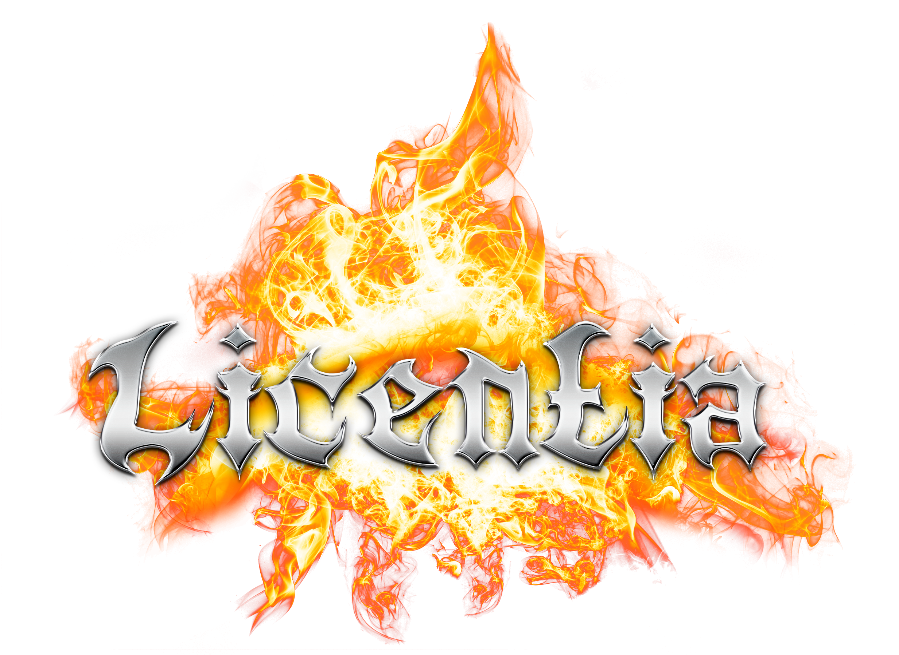

# DO NOT CLOSE ME! This modlist WILL NOT FUNCTION unless you follow the steps in this document.

# READ IT!

- [ATTENTION! UPDATE SKYRIM!](#attention-update-skyrim)
- [Preamble](#preamble)
  - [STRONG WARNINGS](#strong-warnings)
    - [DO NOT ALTER THE MODLIST AND REQUEST SUPPORT FROM WABBAJACK STAFF!](#do-not-alter-the-modlist-and-request-support-from-wabbajack-staff)
  - [Requirements](#requirements)
    - [System Specs](#system-specs)
  - [Installation](#installation)
  - [Pre-Installation](#pre-installation)
    - [Installing Microsoft Visual C++ Redistributable Package](#installing-microsoft-visual-c-redistributable-package)
    - [Steam Config](#steam-config)
  - [Using Wabbajack](#using-wabbajack)
  - [Downloading and Installing](#downloading-and-installing)
  - [Problems with Wabbajack](#problems-with-wabbajack)
  - [Post-Installation](#post-installation)
  - [Preparing the Game](#preparing-the-game)
  - [Crafting the Female Bodies](#crafting-the-female-bodies)
  - [Launching the Game](#launching-the-game)
- [PLEASE CLICK THE BELOW LINK TO CONTINUE THIS ESSENTIAL README. THEN RETURN HERE TO COMPLETE THIS ESSENTIAL README.](#please-click-the-below-link-to-continue-this-essential-readme-then-return-here-to-complete-this-essential-readme)
  - [Updating the Modlist](#updating-the-modlist)
  - [Removing the Modlist](#removing-the-modlist)
  - [Contact](#contact)
  - [Contributing](#contributing)
  - [Changelog](#changelog)

_Thank you to ForgottenGlory for the above image._

# ATTENTION! UPDATE SKYRIM!

Although many of our _Wabbajack_ modlists require you to use the "Skyrim Special Edition Downgrader" before installing them, _Licentia does not._ In order to install this modlist, you **MUST** have your copy of _Skyrim Special Edition_ **COMPLETELY UPGRADED** to the latest version before beginning. It must also be set to the **ENGLISH LANGUAGE,** no other version will function properly. _Wabbajack_ will automatically "downgrade" it and place a copy in the `Stock Game` folder for use during play. I realize this is not an ideal situation, with some our lists requiring one step and the rest requiring another, but hopefully everyone will eventually come around to one method. To reduce the support burden for myself, I have chosen this particular route.

# Preamble

**This Modlist contains mods with sexual content and you need to be of legal age in your country (most western countries: 18+, some eastern ones: 21+)**.

Welcome to the latest incarnation of _Licentia_. This modlist is intended as a high fantasy "Game of Thrones" Skyrim -- ultimate power fantasy where you can use an incredible amount of perks and spells to make the hero _you_ want, with just a touch of racy sexuality. However, it _does not_ do so via unimmersive "slooty" outfits such as bikini armors, lingerie, or various getups that look like costumes or pajamas. It also does not make the sex the point of the game -- you are not simulating sexual slavery with granular breast inflation values down to the millimeter or getting assaulted against your will by everything with a pulse -- the sex is meant is a side minigame or "break" between your hard but rewarding life as an adventurer.

**I apologize for any oversights or inconsistencies in this readme.** It has had many additions and removals over the years and likely needs a full rewrite soon. Until I perfect this document, please struggle through as best you can and feel free to ask me for assistance on Discord or via this Github.

_Want more detailed information before committing to a 300+ GB download?_ Check out the links below.

[Video Preview of Licentia by "Official" Wabbajack Streamer _DroppedIceCream_](https://www.youtube.com/watch?v=vM0xFFFirRc)

[Positive Review of Licentia on Reddit](https://www.reddit.com/r/skyrimmods/comments/qcvrc6/licentia_review_with_links_and_a_thank_you_to_mod/)

[List of All Mods in Licentia on Load Order Library](https://loadorderlibrary.com/lists/licentia)

_Came here because you are experiencing a bug? Check out the Troubleshooting Document:_

[Licentia Troubleshooting](https://github.com/cacophony-wj/LeS/blob/master/TROUBLESHOOTING.md)

The first thing you should probably know is that I am more of a fan of old-school RPG mechanics. I don't like grinding out daggers to level up Smithing or wandering in circles next to a sleeping person to level up Stealth. Therefore, your level does not increase with your skills. Instead, it is the other way around. As you kill things and complete quests, "Experience Points" accumulate until you gain a "level" at which point you can sleep for at least 1 hour in any bed and distribute them to any skill you wish. Also, there are hundreds of additional perks in this modlist, to encourage you to experience a wide variety of options. Therefore, you get more perks than normal. There are also options to receive bonus perks for completing bounties on Giants, Dragons, completing Main Quests, or finishing certain aspects of the mod VIGILANT. Plenty enough to develop any build and become near god-like, but not quite so much that you do everything with one character.

A note about difficulty. _CGO, AGO, Vokriinator Black,_ and all the camera, movement, and spell mods I have included mutiply the player's power almost exponentially. I have yet to stumble on a solution for game balance that accomodates most play styles. As it is, with the MCMs I have scripted, it is probably too easy for anyone who knows the ins and outs of the game. For now, I recommend you leave the values at default until you get a follower (or two) and maybe reach level 10. Then up them as things get too easy (this is a problem with vanilla as well). Not only can you change the difficulty in _Settings,_ you can mess with the options in _Deadly Dragons_ and _Wildcat_ to make things pretty tough on yourself. Dragons will one shot you if their mod is set to "Insane," _Wildcat_ will have you flipping your keyboard when you get juggled with "Full Body Stagger." Experiment! I'll get something better in there one day. I am really bad at the game, lack quality reflexes, and never get a chance to progress very far before something updates or breaks. Report your findings! I may not like to hear them at first but I am always gratified in the end.

A note about the signature followers _Auri, Inigo_ and _Kaiden._ These guys are badasses in the Vanilla game but are stone-cold killers in _Licentia._ I have user reports of them doing 7,000 - 10,000 damage per hit after all the perks given to them are converted to their _Vokriinator Black_ equivalents. As a result, they have all been severely nerfed to put more focus on the player. Most perks having to do with offense and damage multiplication have been removed, a few of the defensive ones are left so they can serve as tanks or distractions. Please keep this in mind as you play and do not report this to the innocent mod authors who designed these mods, they are _not_ meeting their original intention in this list and never could. It is not their problem. _Lucien_ has been left untouched as he has only very basic dual-casting perks at the start. However, he grows as you travel with him, so he may end up quite the badass himself!

A note about "save scumming," which is the practice of quickly saving and reloading many times in a row to get a perfect result, the "Groundhog Day" method of playing a videogame. If you spend 30 minutes reloading after death again and again, especially during or after combat, a _lot_ of stuff will break on your save. I have experienced this first-hand. If you can't get past a group of enemies without repeated deaths and reloads, consider accepting your limitations and retreating, or loading an hour or so back and dialing the difficulty down a few notches. If you continue to save and load rapidly, complete corruption of your save can result. This includes symptoms such as being unable to wield weapons, die, or even load the game. 

# STRONG WARNINGS

Before asking a question, look at [Troubleshooting](https://github.com/cacophony-wj/LeS/blob/master/TROUBLESHOOTING.md). Many common questions are answered there.

## WARNING: THIS MODLIST CONTAINS GRAPHIC SEXUAL CONTENT THAT SOME PLAYERS MAY FIND DISTURBING OR OFFENSIVE. YOU MAY WISH TO AVOID IT IF YOU SUFFER FROM TRAUMA AS EXPLAINED BELOW.

As you may or may not be aware, NSFW Skyrim has a rather sordid history with some of the mods that are developed and even encouraged for it. I have battled back and forth between avoiding them completely and including those which are not "that bad," in a rather limited fashion. As of the 10.40 release, as opposed to compiling and maintaining multiple profiles, I have decided on the latter, and included explicit instructions for disabling the most questionable content.

A handful of mods in this list contain sexual content that may be a bit too "raw" for some players, particularly those which may have encountered some physical, sexual, or emotional abuse in their pasts. The most obvious offenders are two: the _OProstitution_ mod, which enables the player to engage in rather exploitative sex work, and the _ODefeat_ mod, which can force players to engage in non-consensual sexual activity after being defeated in combat. 

To disable the former, simply do not pick up the "Prostitution Lantern" at the beginning of the game, and do not craft it from its crafting station when you come upon it. The latter mod is disabled by default but can be further restricted if so desired. To prevent encountering its content, simply uncheck all of the options in its configuration menu when you reach that section of this readme. 

A couple of the other mods, namly _Amorous Adventures_ and _OStim Solutions_, feature potentially disturbing content including graphic depictions of outlandish fetishes and/or non-consensual sex, however I have gone out of my way to alter them so that all of them are optional and/or clearly marked as offensive. If you wish to avoid them, please do not select any dialog options with a "disturbing content" warning.

The modlist is also extremely easy to customize to prevent almost all graphic sexual content. Please continue reading if you are interested in these options.

## DO NOT ALTER THE MODLIST AND REQUEST SUPPORT FROM WABBAJACK STAFF!

**Officially, absolutely zero changes to the modlist are supported from the Wabbajack server.** If you wish to add or modify the _slightest little thing_, even a seemingly innocuous change such as a RaceMenu or BodySlide preset, an ENB preset or an INI setting, you _must ask for support on my private server in the "additions" channel._ The **only** exceptions are those changes for your particular setup that have already been mentioned elsewhere in this readme, such as mods for Gamepads or UltraWide. Changing resolution is also fine. This is a conscious decision to reduce support requirements for our shared staff. The rule calls for a warning to be issued if you violate this, but I have personally chosen to ignore it (most of the time) because I know how you all are. **However,** I cannot be responsible for the actions of other admins, moderators or support staff. Please don't push it so I don't have to start enforcing it. _Again, if you made even the tiniest change, ask about it on my private server, not on the Wabbajack Discord._ I am extremely tolerant to additions if they are discussed in the proper place.

## Requirements

- [Nexus Premium Account](https://forums.nexusmods.com/index.php?/store/category/1-premium-membership/)
- [LoversLab Account](https://www.loverslab.com/)
- [VectorPlexus Account](https://vectorplexus.com/)

### System Specs

This portion is under review, but my best estimate as to what you need is as follows:

- CPU: >= 7th gen Intel processor OR >= AMD Ryzen 3000 series processor
- GPU: >= 1080, you need at least 6GB of VRAM
- RAM: >= DDR4 with at least 12GBs

Also of UTMOST IMPORTANCE is that you have a VERY LARGE PAGEFILE on the fastest hard drives available to you. I networked with Wabbajack staff to drastically improve the texture quality in this list -- Wabbajack's recommendation of a 20GB pagefile is not enough because that size crashed me in testing. I myself have it at 40GB, but you could probably get away with "System Managed" on each of your SSD's (the OS drive and at least one more)

Speaking of which, everything should be installed on an SSD that has at least 250GB of space available. The game is unplayable on an HDD, although you can relocate your downloads folder to one if you need space.

Please note that you will also require _at least_ an additional 30GB on the drive you installed Wabbajack.exe to for extraction and recompression of files.

## Installation

##  Pre-Installation

These steps are only needed if you install this Modlist for the first time. If you update the Modlist, jump straight to **Updating**  in the **Troubleshooting** section.

###  Installing Microsoft Visual C++ Redistributable Package

I doubt you need to do this since you likely already have this installed. The package is required for MO2 and you can download it from Microsoft. Download the x64 version under "Visual Studio 2015, 2017 and 2019". <a href="https://aka.ms/vs/16/release/vc_redist.x64.exe">Direct link</a> if you can't find it.

###  Steam Config

**Change Steam's Update Behavior**

SSE is still being updated by Bethesda (they only add Creation Club content). Whenever the game updates, the entire modding community goes silent for the next one or two weeks because some mods need to be updated to the latest game runtime version.

To ensure that Steam does not automatically update the game for you and lock you out of playing your _Wabbajack_ modlist(s), head over to the Properties window, navigate to the Updates tab and change Automatic updates to _Only update this game when I launch it_. You should also disable the _Steam Cloud_ while you're at it.

**Set the Game language to English**

Wabbajack will check your game files and make sure that we have the same version. This also means that any other language than English will fail the installation.

Open the Steam Properties window, navigate to the Language tab and select English from the dropdown menu.

**Install Skyrim** (OPTIONAL)

If Skyrim is not installed, do so. _DO NOT_ install it _ANYWHERE_ inside a _Program Files_ folder. This will only wreak havoc in the end. 

If you must, create a Steam library elsewhere on your computer (for example, _D:\Steam_) and install Skyrim there. (Options for such are given within Steam.)

If you only have one hard drive and Steam is installed to _C:\Program Files_, you will have to relocate it to _C:\_. I'm sorry.

**Clean Skyrim**

I highly recommend uninstalling the game through Steam, deleting the game folder and reinstalling it. **Do not install Skyrim anywhere inside any Program Files folder. Wabbajack will not work in a folder that is protected by Windows.** You should also clean up the Skyrim Special Edition folder in Documents/My Games/. 

**Start Skyrim**

After you have done everything above and have a clean SSE installation ready, start the Launcher and open the Options menu.

    Click on Ultra
    Set the Aspect Ratio and Resolution to your monitor's native values
    Set Antialiasing to Off
    Uncheck Windowed Mode and Borderless

Start the game and exit once you're in the main menu.

##  Using Wabbajack

##  Downloading and Installing

The download and installation process can take a very long time depending on your system specs. Wabbajack will calculate the amount of threads it will use at the start of the installation. 

    Adjust the Installation Location to a directory located on the root directory of one of your drives
    For example, this might be "C:\Licentia", "D:\Licentia", or "E:\Licentia"
    Ensure the Download Location is within that directory
    Click the Go/Begin button
    Wait for Wabbajack to finish
    
To have the highest amount of threads and thus the fastest speed, it is advised to have ALL of the folders (for `Wabbajack.exe`, the modlist folder, and the downloads folder) on an SSD. As of my last check, _Licentia_ requires about 200 GB for the modlist itself, and about 110GB for the downloads. You will also need an additional 30 GB beyond the modlists' official size to store temporary working files. All of this space needs to be free on _the same SSD_ to prevent issues during the install.

After it is complete, you can relocate the Downloads to an HDD, external drive, or another cheap storage medium. You can even delete them if you want, they are not needed to play the game, but if the modlist requires an update you may have to download many of them again. It is not recommended to allow your drive to get over 90% full (red bar in File Explorer) so be sure to leave yourself a little headroom on top of all that.

##  Problems with Wabbajack

There are a lot of different scenarios where Wabbajack will produce an error. I recommend re-running Wabbajack before posting anything. Wabbajack will continue where it left off so you lose no progress.

**DO NOT CONTACT MOD AUTHORS DIRECTLY.**

I, cacophony, fully accept any responsibility for difficulties with this list and any conflicts I introduce, so please do not question mod authors on the _Nexus_, _Lover's Lab_, _Vector Plexus_ or any other site about bugs that may result from this lists' use. Direct your questions to me, not the innocent mod authors who should never be expected to support a modlist setup.

**Could not download x:**

If a mod updated and the old files got deleted, it is impossible to download them. In this case just wait till the modlist receives an update.

**x is not a whitelisted download:**

This can happen when update the modlist receives an update. Check if a new update to the modlist is available and wait if there is none.

**Wabbajack could not find my game folder:**

Wabbajack will not work with a pirated version of the game. If you own the game on Steam, go back to the Pre-Installation step. If this still doesn't work, ensure that you are not running Wabbajack as an Administrator. DO NOT ASK FOR HELP WITH PIRATED GAMES ON THE WABBAJACK DISCORD.

**All downloads from Lover's Lab are failing.**

Lover's Lab is much more restrictive about automated downloads to users outside of the United States. Attempt to use a free- or budget- VPN with a terminus in the United States to automate your downloads. I personally recommend Proton VPN from _MIT_, it's free, has decent performance and maintains excellent privacy protections. If you do not have such an option, you will need to download the LL mods manually, as per the manifest section below.

**MEGA download cap exceeded.**

This shouldn't happen unless you download the list multiple times or download multiple Wabbajack lists. Sometimes it does anyway. Try signing up for a MEGA account, or if you have already done so, try logging out of it and downloading anonymously (although much more slowly). I can't tell you to do it, but a VPN _has been known_ to circumvent some of **MEGA**'s restrictions.

**Downloading from the Manifest**

~~Sometimes no matter what anyone tries, a file will not download from Wabbajack for some reason. If that happens to you, go to the _www.wabbajack.org_ website, find the gallery entry for _Licentia_, click _Archive Search_ and type _the filename_ of each mod you cannot download automatically. They can be downloaded from the _link_ icon (looks like a chain link). Ensure that any files you download go to your _Licentia_ downloads directory. Just save them there, do _not_ open them and definitely do _not_ extract them. Close Wabbajack, reopen it, and click the **PLAY** button again.~~

This no longer works due to Axios error on Wabbajack's end. Nothing we can do about it.

**Wabbajack cannot continue because of unknown files.**

Move your downloads folder outside of your _Licentia Directory_, ensure the _Licentia Directory_ is clear of all files, then close and restart Wabbajack. Be sure to point the downloads box to your relocated downloads folder.

## Post-Installation

**REDACTED.** _Licentia_ now makes use of the "Stock Game" feature, so there is no longer a need to download `enbseries` manually, nor to copy over Game Folder Files. Carry on!

Do keep in mind, though, that any changes that would normally be made to the _Skyrim Special Edition_ directory such as changing ENB for better performance, adding Creation Club Content, and so on, must now be placed in the _Licentia/Stock Game_ folder instead.

This does mean, also, that you can install any other list with this feature (Stock Game) and they will be completely independent of each other and no longer require changing out any files whatsoever. Enjoy _Licentia_ when the Old Lady is not around, play _Living Skyrim_ when she's doing annoying things like hogging space in your Man Cave!

## Preparing the Game

The next step is to prepare the game for play. Navigate to the directory where you installed the modlist _Licentia_. Inside you will notice an executable file called _ModOrganizer.exe_. This file (the _Mod Organizer 2_ application) has already been automatically installed and configured by Wabbajack with all the necessary mods to run the modlist and does not need to be updated, replaced, or manually configured. Simply launch it to continue.

## Launching the Game

The rest must be completed after the game itself is launched. I recommend bringing up this readme on a portable device by navigating to [www.wabbajack.org](https://www.wabbajack.org) and referring to the Gallery. Anyway, Launch the modlist from the command which reads **SKSE**. If you receive a message that files are missing, do not exist, or a warning about an incorrect path, you _may_ have to edit the link to "skse_loader" in the drop down and point it to your Skyrim directory. Once you are in-game, create your character and follow _all_ of the instructions in the below link:

# PLEASE CLICK THE BELOW LINK TO CONTINUE THIS ESSENTIAL README. THEN RETURN HERE TO COMPLETE THIS ESSENTIAL README.

[Licentia MCM Configuration And More](https://github.com/cacophony-wj/LeS/blob/master/MCMs.MD)

## Updating the Modlist

Many times newer versions of _Licentia_ will require an updated version of _Wabbajack_, otherwise you will receive an image of a knocked-out Sheo with the message "Corrupted Modlist." Therefore, please ensure that you run _only_ the `Wabbajack.exe` located in the root of your _Wabbajack_ directory, not any of the executables in the archives or version directories (such as _2.5.0.9_). When you do so, _Wabbajack_ will automatically update to the latest version if necessary. 

Then simply re-download the modlist from the Gallery and specify the same directories you did the first time. Then check the "Overwrite" box. This will _delete_ any customizations you have made to the modlist _unless_ you change the names of the folder(s) they are located in. More on this below.

It is rarely recommended to continue a save when you update a modlist because _Skyrim_ super doesn't like it when you do that. Only update on a current save if you wish to start the game over, or if there is some horrible bug with it. In the latter case, I can often write a patch to fix your problem without necessitating a new save. Ask me on my private server. Just to confirm, _none of your save games will be deleted_ when you update. 

## Removing the Modlist

You can just remove the _Licentia_ folder and be done with it. SKSE and ENB files will still be in your game folder so I recommend using [ENB and ReShade Manager](https://www.nexusmods.com/skyrimspecialedition/mods/4143) if you want to remove the ENB.

## Contact

I am regularly available on the [Wabbajack Discord](https://discord.gg/wabbajack) (`#nsfw-mod-discussion`) (`#licentia-support`). I will not respond to direct messages unless I know you. **DO NOT DIRECT MESSAGE ME**

If you enjoyed playing this modlist and feel that your time spent with it was worth any amount of money, consider donating to me in any amount of one dollar or more via my [Patreon](https://www.patreon.com/cacophony1979). Your donation will better the quality of my life and ensure that I can spend more time improving _Licentia._ There are no expectations for a recurring subscription, donate one dollar and immediately cancel if you wish. You will also receive benefits such as access to my Discord server's VIP channel where my friends and Wabbajack staff talk shop, as well as votes and mod suggestions to change the direction of _Licentia_ in the future. Finally, a portion of all proceeds will be forwarded as donations to various signature modders featured in _Licentia_, given that it could not exist without them. **All variant profiles are currently on hiatus due to a bit of burnout on my part.** They **MAY** return at some point in the future.

## Contributing

See [Contributing](CONTRIBUTING.md).

## Changelog

See [Changelog](CHANGELOG.md).
